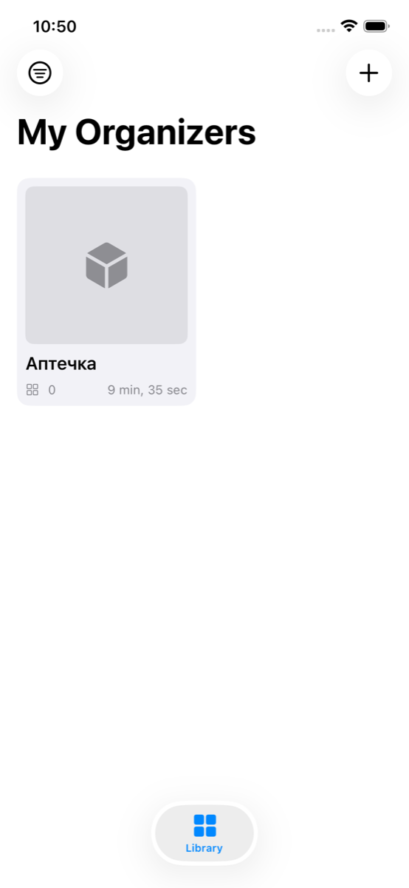
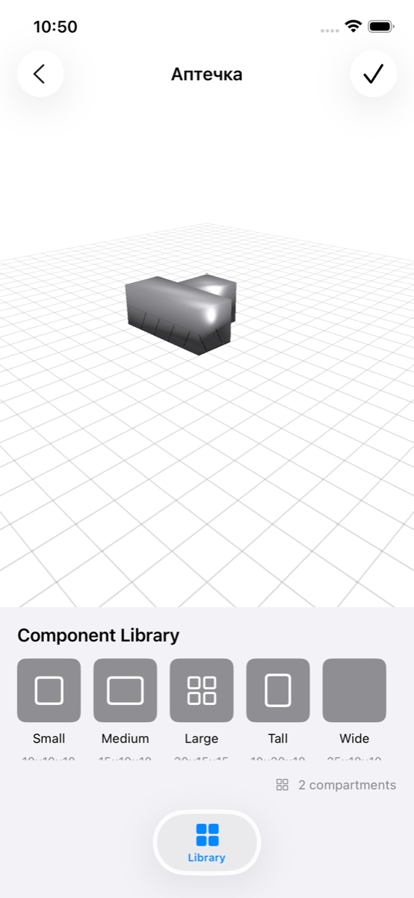
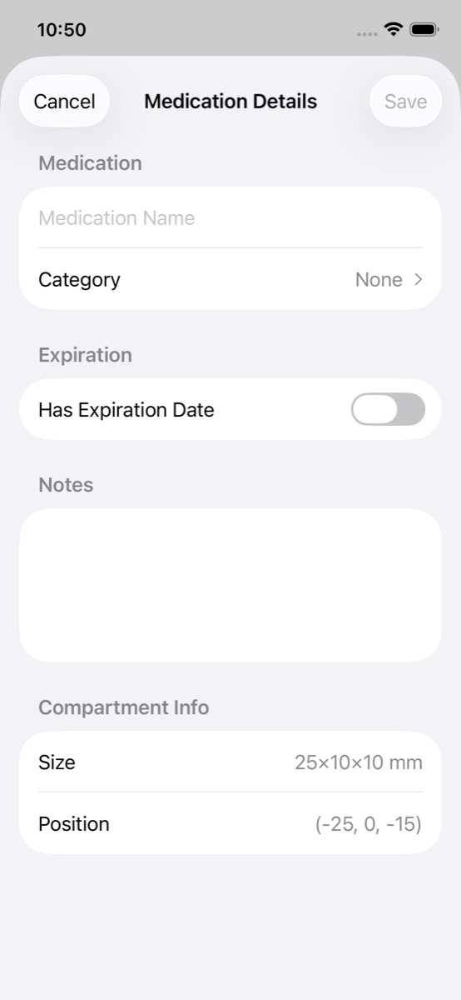
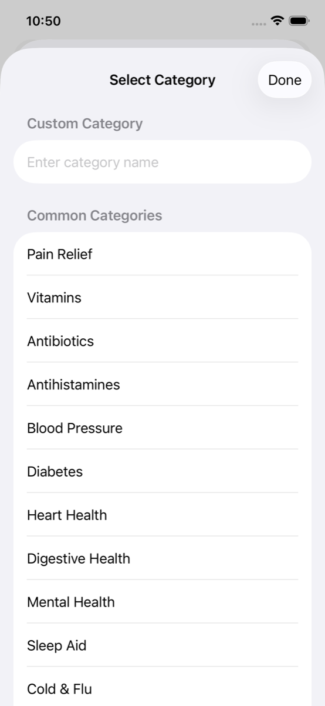
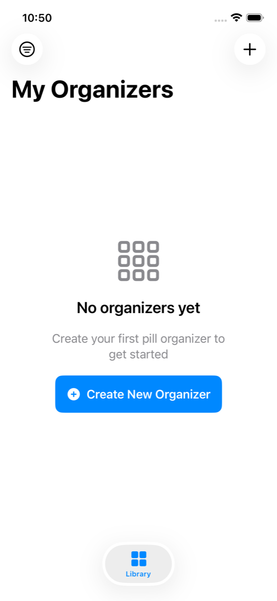

# Peppermint

Peppermint - iOS-приложение для проектирования модульной таблетницы в 3D, назначения лекарств по ячейкам и подготовки дизайна к 3D-печати.

Проект основан на спецификации `specs/001-pill-organizer-3d/*`: офлайн-подход, локальное хранение, 3D-конструктор в стиле LEGO (ячейки с шагом 5 мм), категории и сроки годности лекарств, напоминания, экспорт STL.

## Что это за проект

Приложение решает две задачи:

- Конструктор таблетницы: собрать собственную структуру ячеек, крутить модель, сохранять варианты.
- Медицинская разметка: для каждой ячейки хранить название лекарства, категорию, срок годности и заметки, чтобы быстро ориентироваться в уже напечатанной таблетнице.

Целевая идея продукта: пользователь проектирует таблетницу в приложении, а затем экспортирует модель для печати на 3D-принтере.

## Ключевые возможности

- 3D-сцена с жестами (масштаб, поворот, навигация).
- Модульные ячейки с шагом 5 мм и проверкой пересечений.
- Сохранение дизайнов и превью в локальную библиотеку.
- Карточка ячейки: лекарство, категория, срок годности, заметки.
- Визуальные индикаторы истекающих/просроченных лекарств.
- Офлайн-first и локальное хранение данных.

## Технологии

- Swift 5.9
- SwiftUI
- SceneKit
- Core Data
- XcodeGen (`project.yml`)
- iOS 17.0+

## Структура проекта

- `Peppermint/App` - вход в приложение и корневая навигация
- `Peppermint/Views/Library` - библиотека сохраненных органайзеров
- `Peppermint/Views/Constructor` - 3D-конструктор и экран деталей ячейки
- `Peppermint/ViewModels` - логика состояния и сценариев
- `Peppermint/Services` - 3D-сцена, персистентность, генераторы геометрии
- `Peppermint/Models` - Core Data сущности
- `Peppermint/Resources` - локализация и предустановленные компоненты

## Запуск локально

1. Сгенерировать Xcode-проект:

```bash
xcodegen generate
```

2. Открыть проект:

```bash
open Peppermint.xcodeproj
```

3. Запустить target `Peppermint` из Xcode.

## Скриншоты

<p>
  
  
  
  
  
</p>

## Git и приватные файлы

В `.gitignore` исключены локальные служебные файлы:

- `.claude/`
- `.specify/`
- `CLAUDE.md`
- `specs/`
